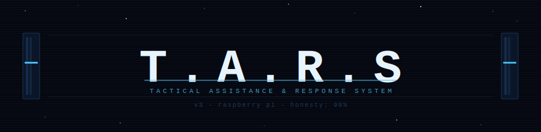
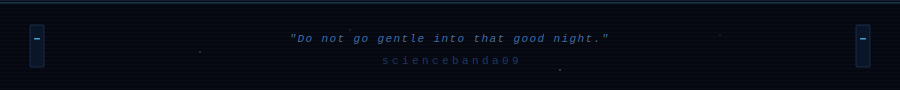

<div align="center">



<br/>


<br/><br/>


<br/>


</div>

---

## WHAT IS THIS

A GPT-powered, voice-driven robot assistant running on a Raspberry Pi. Inspired by the robot from *Interstellar* — dry wit, precise execution, and just enough personality to make you wonder if it's judging you. It moves, it watches sensors, it speaks, it remembers your conversations, and if you leave it alone for too long, it will say something unsolicited about the temperature.

> *"Absolute honesty isn't always the most diplomatic or the safest form of communication with emotional beings."*
> *"Ninety percent, then."*

Built because the movie deserved a physical tribute, and because building something that talks back is more interesting than one that doesn't.

---

## WHAT CHANGED IN v2

| Area | v1 | v2 | Vibe |
|---|---|---|---|
| AI | Single call, basic retry | Retry with back-off, confidence tags, emotion model, wake-word gate | now has feelings |
| Memory | Flat JSON list | Episodic memory, semantic intent tagging, schema versioning, thread-safe writes | remembers you |
| Motors | Instant speed changes | Smooth acceleration ramp, timed moves, dead-reckoning odometer | less violence |
| Sensor | Raw average | Kalman-filtered distance, rolling temp average, trend detection, health monitor | less noise |
| Display | Static expressions | Background blink thread, boot animation, expression registry | it blinks now |
| Voice | Blocking TTS | Non-blocking TTS queue, offline fallback phrases, scheduled recalibration | won't freeze mid-sentence |
| Fan | On/off relay | Proportional duty cycle, cumulative uptime tracking | thermal dignity |
| Sound | absent | Synthesised effects: beep, power up/down, error, success | it has a voice |
| Main loop | Single thread | Dedicated safety-monitor at 10 Hz, SIGTERM handler, clean shutdown | survives ctrl-c |
| Tests | absent | pytest suite covering memory, AI, and sensor logic | 14 passing |

---

## WHAT'S NEW IN v3

### Proactive Idle Behaviour

When no one speaks for `TARS_IDLE_TIMEOUT` seconds (default 40s), TARS picks a dry ambient line, shifts its OLED expression, and says it. Then waits 30–90 seconds before doing it again, randomised so it never feels like a loop. It is not malfunctioning. It is simply bored.

A `ProactiveAlertMonitor` thread polls sensors every 5 seconds and speaks unprompted when:

| Condition | Threshold | Behaviour |
|---|---|---|
| Temperature warning | 42°C | calm, informational |
| Temperature critical | 60°C | urgent tone |
| Obstacle detected | 20cm | immediate |

All thresholds are environment-variable tunable. Alerts reset correctly once conditions normalise.

### PIR Motion Wake System

Hardware: HC-SR501 on GPIO 27 (BCM). TARS starts awake. After `TARS_SLEEP_AFTER` seconds (default 120s) of no motion it locks motors, shows `SLEEPING` on the OLED, and pauses the voice loop. When the PIR fires, it plays a power-up sound and greets whoever walked in. `notify_activity()` is called on every voice command so it won't sleep mid-conversation.

Mock mode: if `RPi.GPIO` is unavailable (laptop, CI), TARS stays permanently awake. Nothing breaks.

```
HC-SR501 wiring:
  VCC  →  5V pin
  GND  →  GND pin
  OUT  →  GPIO 27 (BCM)
```

### Web Dashboard

Served at `http://<pi-ip>:8080`. Zero external dependencies — pure stdlib `http.server`.

| Panel | What it shows |
|---|---|
| OLED preview | HTML5 canvas mirroring the real display in real time |
| Sensor telemetry | Temperature + trend, obstacle distance + trend, humidity |
| Personality bars | Humor / Honesty / Verbosity, live |
| System stats | Interaction count, session uptime, fan state, PIR awake state |
| D-pad controls | Direct motor commands with speed slider |
| Command input | Type anything TARS would understand via voice |
| Conversation log | Scrolling turn-by-turn transcript with timestamps |

Commands entered in the browser go through the full AI loop — same path as a spoken command.

---

## HOW IT WORKS

```
you speak
    |
    v
wake-word check  ──  not "tars"  ──>  ignored
    |
    v  (wake word matched, or wake-word gate disabled)
speech-to-text  (Google STT or offline fallback)
    |
    v
local command check  ──  stop/halt/status/volume  ──>  handled immediately, no API call
    |
    v
AI call  (GPT-4o-mini, with system prompt, emotion state, last 12 messages)
    |                                      |
    v                                      v
tool call returned                     plain text returned
    |                                      |
    v                                      v
tool dispatcher                        TTS queue  (non-blocking)
  ├── control_motion  ──>  motors            |
  ├── read_telemetry  ──>  sensor            v
  ├── set_display_expression  ──>  OLED   TARS speaks
  ├── play_sound_effect  ──>  sounds.py     |
  └── adjust_parameters  ──>  personality   |
    |                                      |
    └──────────────────┬───────────────────┘
                       v
              episodic memory write
              (turn count, summary, mood, dominant intent)
                       |
                       v
              emotion model update
              (neutral / curious / amused / concerned / focused / bored)
                       |
                       v
              OLED expression update  ──  background blink thread continues
```

```
parallel threads running at all times:
  safety monitor       10 Hz  ──  kills motors if obstacle < 8cm
  PIR monitor          event  ──  wake/sleep transitions
  proactive idle       timer  ──  mutters when alone too long
  proactive alerts     5s     ──  speaks when temp or obstacle thresholds cross
  blink animation      async  ──  OLED eye blink, independent of everything else
  dashboard server     daemon ──  HTTP on 8080
```

---

## HARDWARE

| Component | Part | GPIO (BCM) |
|---|---|---|
| Motor driver | L298N H-bridge | IN1=17, IN2=18, ENA=22, IN3=23, IN4=24, ENB=25 |
| Temperature / humidity | DHT11 | DATA=4 |
| Ultrasonic range | HC-SR04 | TRIG=20, ECHO=16 |
| PIR motion sensor | HC-SR501 | OUT=27 |
| Cooling fan | 5V relay or PWM fan | 21 |
| OLED display | SSD1306 128x64 | I2C: SDA=2, SCL=3 |
| Microphone | USB or I2S mic | — |

All pin assignments are configurable at the top of each module.

---

## QUICK START

```bash
# clone
git clone <your-repo-url> tars_robot
cd tars_robot

# environment
python -m venv .venv
source .venv/bin/activate
pip install -r requirements.txt

# configure
cp .env.example .env
# add OPENAI_API_KEY — the only required value

# run
python -m tars.main
# dashboard will be at http://localhost:8080
# (if you're on Pi, replace localhost with the Pi's IP)
```

---

## RUNNING TESTS

No hardware required. All tests mock GPIO and OpenAI.

```bash
pytest tests/ -v
```

```
tests/test_ai.py::test_generate_returns_text              PASSED
tests/test_ai.py::test_generate_returns_tool_calls        PASSED
tests/test_ai.py::test_no_client_returns_offline_message  PASSED
tests/test_ai.py::test_wake_word_filtering                PASSED
tests/test_ai.py::test_emotion_state_updates              PASSED
tests/test_memory.py::test_default_memory_keys            PASSED
...
14 passed  (none of them required a real Raspberry Pi)
```

---

## VOICE COMMANDS

TARS understands natural language via GPT. A small set is handled locally — no API call, no latency:

| Say | Effect |
|---|---|
| "stop" / "halt" / "freeze" | cuts motor power immediately |
| "status" / "telemetry" | reads all sensors aloud |
| "volume up" / "volume down" | adjusts TTS volume |

Everything else goes to GPT with the full tool suite available.

---

## TOOLS AVAILABLE TO TARS

| Tool | What TARS can do |
|---|---|
| `control_motion` | move forward / backward / left / right / stop, optional duration |
| `adjust_parameters` | set humor, honesty, or verbosity 0–100 at runtime |
| `read_telemetry` | live sensor snapshot |
| `set_display_expression` | change OLED face |
| `play_sound_effect` | beep / power_up / error / success / thinking |

---

## PERSONALITY PARAMETERS

| Parameter | Default | Effect |
|---|---|---|
| Humor | 70% | frequency of dry observations |
| Honesty | 90% | willingness to tell you things you'd rather not hear |
| Verbosity | 50% | response length |

Adjustable at runtime:

> *"TARS, set humor to 40 percent."*
> *"TARS, increase honesty to 100 percent."* — not recommended

---

## EMOTION MODEL

TARS maintains an internal `EmotionState` that shifts between `neutral`, `curious`, `amused`, `concerned`, `focused`, and `bored` based on conversation content. The active mood feeds into the system prompt, drives the OLED expression, and is written to episodic memory after each interaction cycle.

The bored state is self-explanatory.

---

## EPISODIC MEMORY

After each interaction cycle, a summary is written to `episodes` in `memory.json`:

```json
{
  "ts": "2025-01-15T14:32:01Z",
  "turn_count": 3,
  "summary": "User: move forward | TARS: Moving forward at 50%",
  "mood": "focused",
  "dominant_intent": "motion"
}
```

Up to 20 episodes retained (configurable via `TARS_MAX_EPISODES`). It knows what you talked about last time. Whether it brings it up is a matter of verbosity.

---

## ENVIRONMENT VARIABLES

| Variable | Default | Description |
|---|---|---|
| `OPENAI_API_KEY` | — | required |
| `OPENAI_MODEL` | `gpt-4o-mini` | model string |
| `TARS_REQUIRE_WAKE_WORD` | `false` | set `true` to only respond when "tars" is heard |
| `TARS_WAKE_WORD` | `tars` | wake word |
| `TARS_MEMORY_FILE` | `memory.json` | persistence file path |
| `TARS_MAX_HISTORY_MESSAGES` | `40` | conversation turns kept in context |
| `TARS_MAX_EPISODES` | `20` | episodic memory entries retained |
| `TARS_MODEL_HISTORY_WINDOW` | `12` | messages sent to API per call |
| `TARS_AI_MAX_RETRIES` | `3` | API retry attempts |
| `TARS_IDLE_TIMEOUT` | `40` | seconds before TARS starts talking to itself |
| `TARS_SLEEP_AFTER` | `120` | seconds of no PIR activity before sleep mode |
| `TARS_TEMP_ALERT_C` | `42` | temperature warning threshold |
| `TARS_TEMP_DANGER_C` | `60` | temperature critical threshold |
| `TARS_OBSTACLE_ALERT` | `20` | obstacle proximity alert distance (cm) |
| `TARS_DASHBOARD_PORT` | `8080` | web dashboard port |
| `TARS_DASHBOARD_HOST` | `0.0.0.0` | bind address (0.0.0.0 for LAN access) |

---

## PROJECT STRUCTURE

```
tars_robot/
├── tars/
│   ├── ai.py          # LLM brain — emotion model, tool schemas, retry with back-off
│   ├── dashboard.py   # HTTP dashboard — stdlib only, zero dependencies  (v3)
│   ├── display.py     # OLED expression engine — blink thread, boot animation
│   ├── fan.py         # proportional thermal control — it has uptime memory too
│   ├── idle.py        # proactive idle monologue + sensor alerts  (v3)
│   ├── main.py        # orchestrator — voice + dashboard + PIR + safety thread
│   ├── memory.py      # episodic memory — atomic writes, semantic tagging
│   ├── motors.py      # H-bridge driver — smooth ramp, timed moves, odometer
│   ├── pir.py         # PIR wake/sleep controller  (v3)
│   ├── sensor.py      # Kalman-filtered distance, rolling temp, trend detection
│   ├── sounds.py      # synthesised sound effects  (v2)
│   └── voice.py       # async TTS queue, STT with scheduled recalibration
├── tests/
│   ├── test_ai.py     # mocked GPT calls
│   ├── test_memory.py # schema, versioning, thread safety
│   └── test_sensor.py # Kalman filter, trend logic
├── .env.example       # copy this. fill in one key. run.
├── LICENSE
├── README.md
└── requirements.txt
```

---

## TECH STACK

| Layer | Technology | Why |
|---|---|---|
| AI | OpenAI GPT-4o-mini | fast enough, cheap enough, personality-capable |
| Speech-to-text | Google STT via SpeechRecognition | works on Pi without a GPU |
| Text-to-speech | pyttsx3 (async queue) | offline, no API call |
| Motors | RPi.GPIO + L298N | direct H-bridge control |
| Sensor filtering | Kalman filter (hand-rolled) | ultrasonic readings are noisy |
| OLED | luma.oled + PIL | SSD1306 expression rendering |
| Sound synthesis | numpy + sounddevice | no audio files, all generated |
| Dashboard | stdlib http.server | zero additional dependencies |
| Memory | JSON with atomic writes | no database to install or lose |
| Tests | pytest with GPIO mocks | runs on any machine |

---

## LICENSE

Apache 2.0. See `LICENSE`.

---

<div align="center">



</div>
